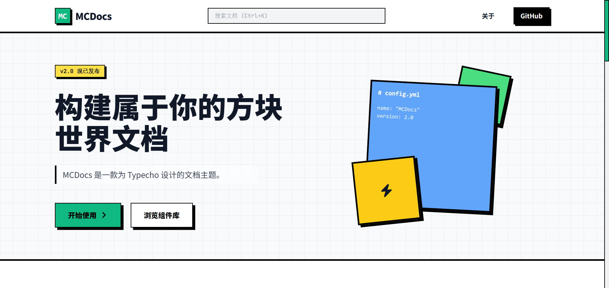
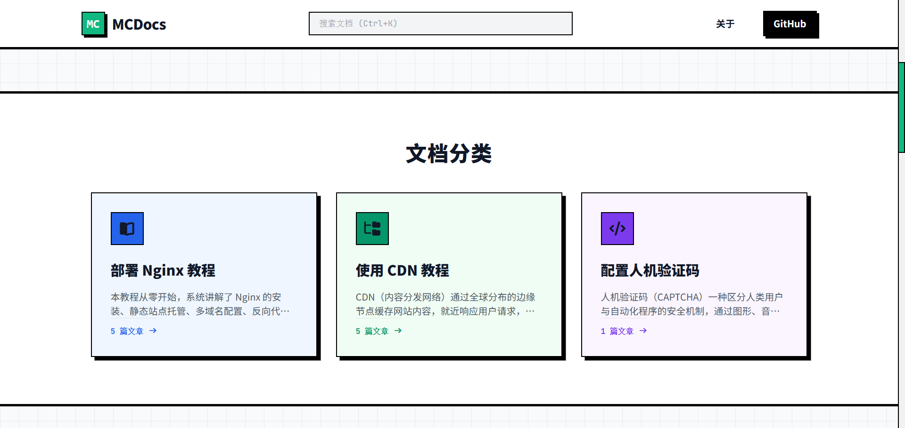
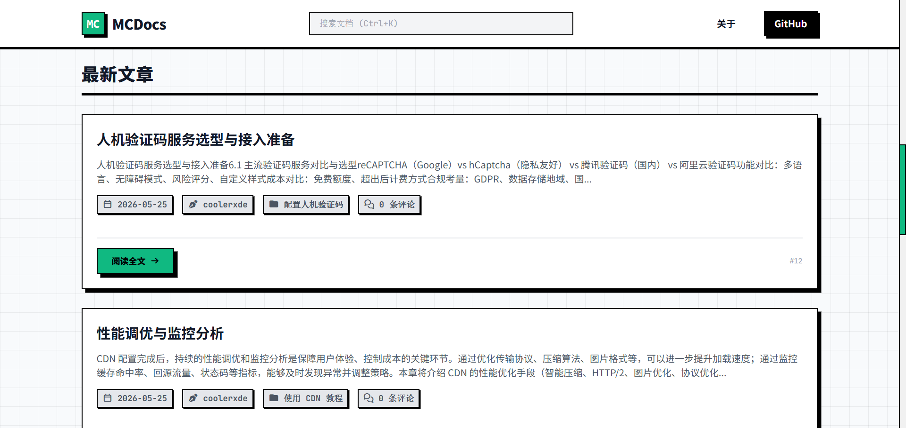
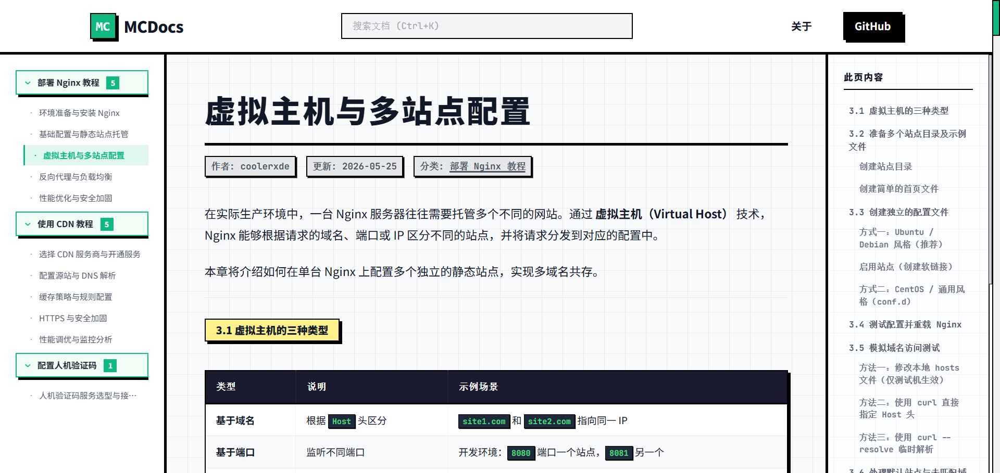
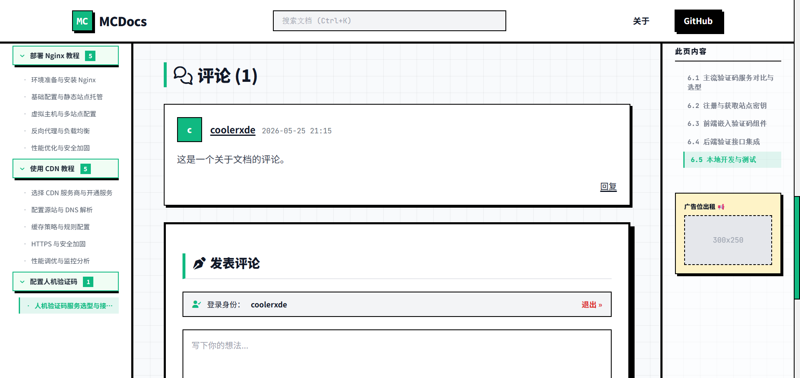
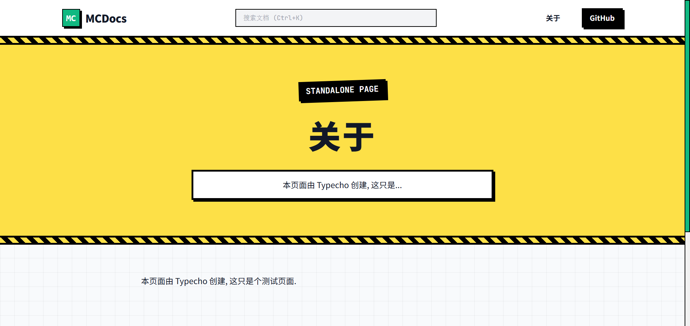
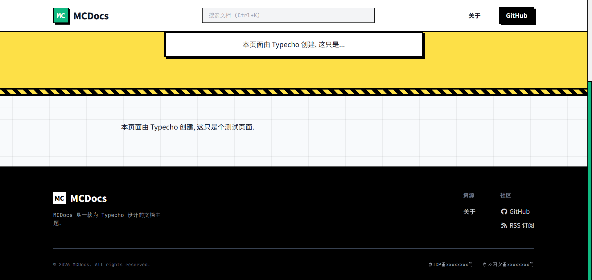
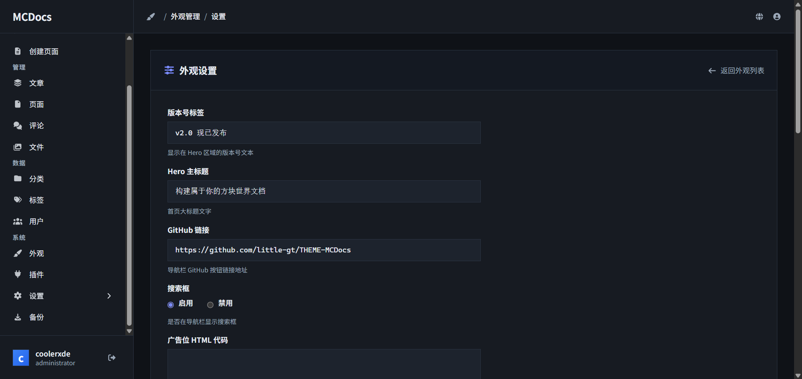
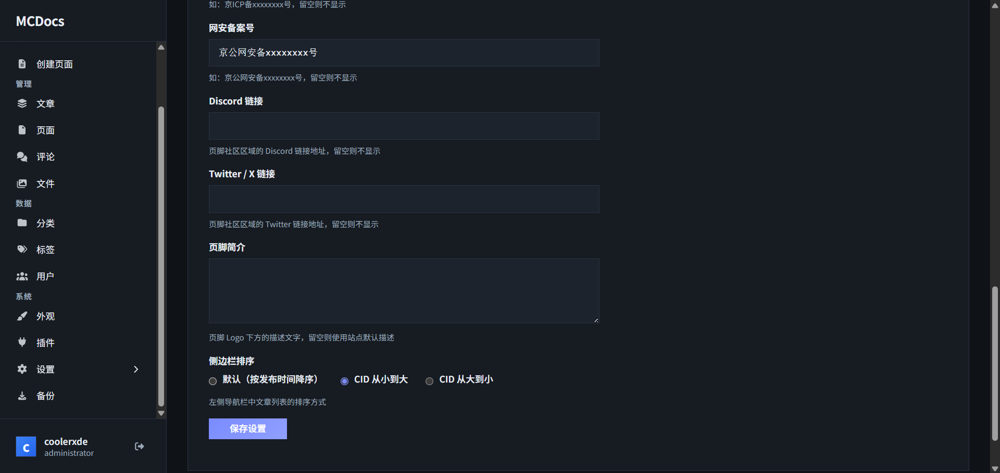

# MCDocs

> MCDocs 是一款为 Typecho 设计的文档主题 ，采用矩形方块美学、三栏布局、FontAwesome 7 图标系统，专为技术文档和知识库类站点打造，具有完整的评论嵌套、搜索高亮、响应式适配及丰富的主题配置项。

[](https://github.com/little-gt/THEME-MCDocs/) [](https://www.gnu.org/licenses/gpl-3.0.html) [](https://tailwindcss.com/)

## 预览

<!-- 截图 1：首页 Hero 区域 -->
<p align="center">

</p>
*Hero 区域：版本徽章 + 主标题 + 装饰方块 + CTA 按钮*

---

<!-- 截图 2：文档分类 -->
<p align="center">

</p>
*动态读取分类，点击跳转至该分类下最新文章，底部显示文章计数*

---

<!-- 截图 3：最新文章列表 -->
<p align="center">

</p>
*文章卡片：摘要 + 元信息标签 + 「阅读全文」按钮 + CID 编号*

---

<!-- 截图 4：文章详情页 -->
<p align="center">

</p>
*三栏布局：左侧分类导航树 + 正文内容区 + 右侧 TOC 目录大纲*

---

<!-- 截图 5：文章详情（代码块） -->
<p align="center">

</p>
*内置代码框样式：macOS 三圆点装饰条 + 深色背景 + 自定义滚动条*

---

<!-- 截图 6：文章详情（表格） -->
<p align="center">

</p>
*表格样式：深色表头 + 斑马纹 + hover 高亮 + 硬阴影边框*

---

<!-- 截图 7：独立页面 -->
<p align="center">

</p>
*独立页面：全宽 Hero 横幅 + 居中正文区域*

---

<!-- 截图 8：独立页面（自定义模板） -->
<p align="center">

</p>
*支持 team / pricing / faq 三种自定义页面模板*

---

## 功能特性

- **粗野主义设计** — 矩形方块、硬阴影、零圆角，视觉冲击力强
- **自动目录生成** — JavaScript 从文章正文提取 h2/h3/h4，右侧实时高亮
- **嵌套评论** — 支持多级回复，递归渲染子评论
- **搜索关键词高亮** — 匹配内容 `<mark>` 标记，兼容伪静态和普通参数两种模式
- **动态分类展示** — 首页「文档分类」区域从数据库读取，点击直达最新文章
- **完整配置面板** — 备案信息、社交链接、统计代码、自定义 CSS、侧边栏排序
- **FontAwesome 图标** — 全站零 Emoji，统一图标语言
- **响应式布局** — 移动端自适应，双侧边栏独立滚动

### 样式覆盖范围

| 元素 | 说明 |
|------|------|
| 行内代码 | 红字灰底硬阴影 (`<code>`) |
| 代码块 | macOS 三圆点 + 深色底 + 绿色文字 |
| 表格 | 深色表头 + 斑马纹 + hover 黄高亮 |
| 引用块 | 蓝左边框 + 浅蓝背景 |
| H2 标题 | 黄底黑框内联标签 |
| H3 标题 | 左侧绿色竖线 |

## 环境要求

- **Typecho** ≥ 1.3.0
- **PHP** ≥ 7.4

## 安装

```bash
cd usr/themes/
git clone https://github.com/little-gt/THEME-MCDocs.git MCDocs
```

进入 **控制台 → 外观 → 启用 MCDocs** 即可。

## 配置说明

进入 **外观 → MCDocs 设置**：

### 基础设置

| 配置项 | 默认值 | 说明 |
|--------|--------|------|
| 版本号标签 | `v2.0 已发布` | 首页 Hero 区域显示的版本文字 |
| Hero 主标题 | `构建属于你的方块世界文档` | 首页大标题 |
| 页脚简介 | （使用站点描述） | 页脚 Logo 下方的描述文字 |

### 链接与社交

| 配置项 | 说明 |
|--------|------|
| GitHub 链接 | 导航栏和页脚，留空不显示 |
| Discord | 页脚社区区域，留空不显示 |
| Twitter / X | 页脚社区区域，留空不显示 |

### 功能开关

| 配置项 | 默认值 | 说明 |
|--------|--------|------|
| 搜索框 | 启用 | 导航栏是否显示（Ctrl+K 始终可用） |
| 侧边栏排序 | 默认 | `default` / `cid_asc` / `cid_desc` |

### 广告与分析

| 配置项 | 说明 |
|--------|------|
| 广告位 HTML | 文章页右侧边栏广告位 |
| Google Analytics ID | 自动注入 GTag 脚本 |

### 样式定制

| 配置项 | 说明 |
|--------|------|
| 自定义 CSS | 输出到 `</body>` 前 |
| Favicon 地址 | 留空使用默认 |
| ICP 备案号 | 留空不显示 |
| 网安备案号 | 留空不显示 |

### 后台设置面板

<!-- 截图 9：设置面板 1 -->
<p align="center">

</p>

<!-- 截图 10：设置面板 2 -->
<p align="center">

</p>

## 自定义字段

| 字段名 | 适用模板 | 说明 |
|--------|---------|------|
| `template` | page | `team` / `pricing` / `faq` 触发特殊布局 |
| `closeComment` | post | 设为 `true` 关闭评论区 |
| `excerpt` | post | 文章摘要 |
| `notice` | post | 正文前提示块 |
| `subtitle` | page | 覆盖 Hero 描述（截取 20 字符） |
| `thumbnail` | post | 缩略图 URL |

## 文件结构

```
MCDocs/
├── header.php       # 导航栏、搜索(Ctrl+K)、移动端菜单、FA CDN
├── index.php        # 首页：Hero + 动态分类卡 + 最新文章列表
├── post.php         # 文章详情：三栏布局、TOC、广告位、标签导航
├── page.php         # 独立页面（支持 team/pricing/faq 模板）
├── category.php     # 分类归档：文章卡片 + CTA 按钮
├── search.php       # 搜索结果：关键词高亮 + 自适应搜索栏
├── comments.php     # 评论嵌套 + CSRF Token 兜底 + 已登录状态
├── sidebar.php      # 左侧文档树（Widget API + Router + 可配置排序）
├── footer.php       # 页脚：品牌、链接、备案、GA、自定义 CSS
├── 404.php          # 错误页（浮动动画）
├── functions.php    # themeConfig() + 辅助函数
└── style.css        # CSS 变量 + 粗野主义系统 + 代码框/表格/滚动条
```

## 技术要点

**侧边栏数据**：`\Widget\Metas\Category\Rows` 获取分类，单次 JOIN `contents` + `relationships` 按 mid 分组。永久链接通过 `\Typecho\Router::url('post', [...])` 生成。

**CSRF 兜底**：表单内 PHP 直接输出 `<input type="hidden" name="_">`。Typecho 原生 JS 注入需等待用户交互后才生效，快速提交时可能缺失 Token。

**嵌套评论**：`$comments->listComments($options)` 调用全局 `threadedComments($comments, $options)` 函数（comments.php 底部），内部 `$comments->threadedComments()` 递归渲染子回复。

**搜索兼容**：`$this->getKeywords()` 读取 `$this->archiveKeywords`，同时覆盖伪静态 `/search/关键词/` 和 `?s=关键词`。

**侧边栏排序**：通过 switch-case 构建不同 `->order()` 的查询对象，支持按发布时间 / CID 升序 / CID 降序三种模式。

**长内容适配**：两侧边栏 `sticky` + `calc(100vh - 4rem)` + `overflow-y: auto`；分类展开列表 `max-height: calc(100vh - 16rem)` 自适应视口；提示区域 `margin-top: auto` 固定底部。